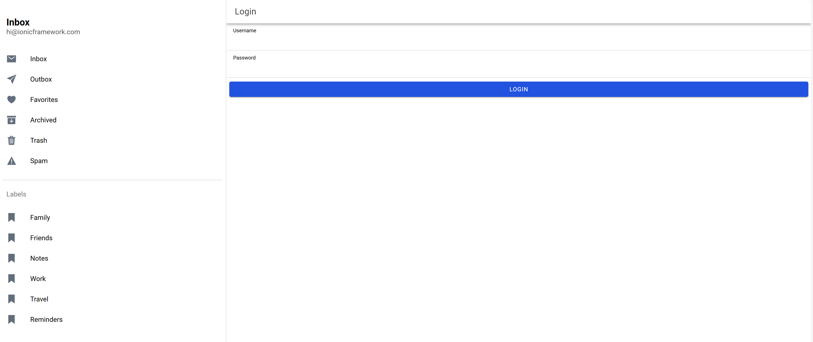

# Tugas Pertemuan 8 - Proyek Ionic

**Nama:** Muhammad Levi Asshidiqi  
**NIM:** H1D022103  
**Shift Baru:** A  

# Tugas Pertemuan 3

Buat Aplikasi dengan flutter yang mengimplementasikan routes, side menu, login, dan local storage. Namun TIDAK BOLEH SAMA PERSIS SEPERTI DI MODUL. Semakin kreatif semakin baik nilainya.

NB : Buat repository baru saja, eg: LabMobile3_Nama_ShiftBaru

Hal yang perlu dikumpulkan :
1. Link Repo berisi Source Code
2. Readme.md yang berisi Penjelasan tiap bagian penting kode dan SS tampilan aplikasi Anda.

Nama : Muhammad Levi Asshidiqi

NIM : H1D022103

Shift Baru: A


file `app.module.ts`
```
import { NgModule } from '@angular/core';
import { BrowserModule } from '@angular/platform-browser';
import { RouteReuseStrategy } from '@angular/router';

import { IonicModule, IonicRouteStrategy } from '@ionic/angular';
import { provideHttpClient } from '@angular/common/http';

import { AppComponent } from './app.component';
import { AppRoutingModule } from './app-routing.module';

@NgModule({
  declarations: [AppComponent],
  imports: [BrowserModule, IonicModule.forRoot(), AppRoutingModule],
  providers: [{ provide: RouteReuseStrategy, useClass: IonicRouteStrategy }, provideHttpClient()],
  bootstrap: [AppComponent],
})
export class AppModule { }

```

1. provideHttpClient digunakan untuk mendeklarasikan HttpClient, sehingga aplikasi dapat berinteraksi dengan API eksternal.

2. AppComponent digunakan sebagai komponen root, sementara AppRoutingModule mengatur jalur navigasi aplikasi.


file `authentication.service.ts`
```
import { Injectable } from '@angular/core';
import { HttpClient } from '@angular/common/http';
import { AlertController } from '@ionic/angular';
import { BehaviorSubject, from, Observable, switchMap } from 'rxjs';
import { Preferences } from '@capacitor/preferences';
const TOKEN_KEY = 'auth-login';
const USER_KEY = 'auth-user';

@Injectable({
  providedIn: 'root'
})
export class AuthenticationService {

  constructor(private http: HttpClient, private alert: AlertController) {
    this.authenticationState = from(this.loadData()).pipe(
      switchMap(() => this.isAuthenticated)
    );
  }

  isAuthenticated: BehaviorSubject<boolean> = new BehaviorSubject<boolean>(false);
  authenticationState: Observable<boolean>;
  token = '';
  nama = '';
  saveData(token: string, user: any) {
    Preferences.set({ key: TOKEN_KEY, value: token });
    Preferences.set({ key: USER_KEY, value: user });
    this.token = token;
    this.nama = user;
    this.isAuthenticated.next(true);
  }

  async loadData() {
    const token = await Preferences.get({ key: TOKEN_KEY });
    const user = await Preferences.get({ key: USER_KEY });
    if (token && token.value && user && user.value) {
      this.token = token.value;
      this.nama = user.value;
      this.isAuthenticated.next(true);
    } else {
      this.isAuthenticated.next(false);
    }
  }

  clearData() {
    this.token = '';
    this.nama = '';
    Preferences.remove({ key: TOKEN_KEY });
    Preferences.remove({ key: USER_KEY });
  }

  postMethod(data: any, link: any): Observable<any> {
    return this.http.post(this.apiURL() + '/' + link, data);
  }

  notifikasi(pesan: string) {
    return this.alert.create({
      header: 'Notifikasi',
      message: pesan,
      buttons: ['OK']
    }).then(res => {
      res.present();
    });
  }

  apiURL() {
    return 'http://localhost/coba-login';
  }

  logout() {
    this.isAuthenticated.next(false);
    this.clearData();
  }
}

```

1. Token dan Data Pengguna: AuthenticationService menyimpan token autentikasi dan nama pengguna ke dalam Capacitor Preferences (penyimpanan lokal).

2. Menyimpan Data Login (saveData): Ketika login berhasil, token dan nama pengguna disimpan ke dalam storage lokal, dan isAuthenticated diubah menjadi true, menunjukkan pengguna sudah terotentikasi.

3. Memuat Data (loadData): Ketika aplikasi dimulai, loadData akan mengecek apakah ada token dan data pengguna yang tersimpan. Jika data tersedia, isAuthenticated akan menjadi true, memungkinkan pengguna tetap masuk ke aplikasi.

4. Menghapus Data (clearData): Digunakan saat logout, menghapus token dan data pengguna dari storage lokal.

5. postMethod: Digunakan untuk mengirim data login ke API eksternal.

6. Notifikasi (notifikasi): Menampilkan pesan notifikasi kepada pengguna menggunakan AlertController.

file `auth.guard.ts`
```
import { CanActivateFn, Router } from '@angular/router';
import { AuthenticationService } from '../services/authentication.service';
import { inject } from '@angular/core';
import { filter, map, take } from 'rxjs';

export const authGuard: CanActivateFn = (route, state) => {
  const authService = inject(AuthenticationService);
  const router = inject(Router);

  return authService.authenticationState.pipe(
    filter((val) => val !== null),
    take(1),
    map((isAuthenticated) => {
      if (isAuthenticated) {
        return true;
      } else {
        router.navigateByUrl('/login', { replaceUrl: true });
        return true;
      }
    })
  );
};


```

1. authGuard memastikan bahwa pengguna yang belum login tidak bisa mengakses halaman tertentu.

2. Jika isAuthenticated bernilai false, pengguna diarahkan ke halaman login.

file `auto-login.guard.ts`
```
import { inject } from '@angular/core';
import { CanActivateFn, Router } from '@angular/router';
import { AuthenticationService } from '../services/authentication.service';
import { filter, map, take } from 'rxjs';

export const autoLoginGuard: CanActivateFn = (route, state) => {
  const authService = inject(AuthenticationService);
  const router = inject(Router);

  return authService.authenticationState.pipe(
    filter((val) => val !== null),
    take(1),
    map((isAuthenticated) => {
      if (isAuthenticated) {
        router.navigateByUrl('/home', { replaceUrl: true });
        return true;
      } else {
        return true;
      }
    }
    ))
};

```

1. autoLoginGuard: Mengecek status autentikasi ketika pengguna mengakses halaman login. Jika pengguna sudah login, mereka diarahkan ke halaman utama (/home).

file `app-routing.module.ts`
```
import { NgModule } from '@angular/core';
import { PreloadAllModules, RouterModule, Routes } from '@angular/router';
import { authGuard } from './guards/auth.guard';
import { autoLoginGuard } from './guards/auto-login.guard';

const routes: Routes = [
  {
    path: 'home',
    loadChildren: () => import('./home/home.module').then(m => m.HomePageModule),
    canActivate: [authGuard]
  },
  {
    path: '',
    redirectTo: 'login',
    pathMatch: 'full'
  },
  {
    path: 'login',
    loadChildren: () => import('./login/login.module').then(m => m.LoginPageModule),
    canActivate: [autoLoginGuard]
  },
  {
    path: 'home',
    loadChildren: () => import('./home/home.module').then( m => m.HomePageModule)
  },
];

@NgModule({
  imports: [
    RouterModule.forRoot(routes, { preloadingStrategy: PreloadAllModules })
  ],
  exports: [RouterModule]
})
export class AppRoutingModule { }

```

1. canActivate Guards: Halaman home hanya dapat diakses oleh pengguna yang sudah login menggunakan authGuard.

2. Auto-redirect di Halaman Login: Halaman login menggunakan autoLoginGuard, sehingga jika pengguna sudah login, mereka diarahkan ke halaman utama (/home).


file `login.page.html`
```
<ion-header [translucent]="true">
  <ion-toolbar>
    <ion-title>Login</ion-title>
  </ion-toolbar>
</ion-header>

<ion-content [fullscreen]="true">
  <ion-header collapse="condense">
    <ion-toolbar>
      <ion-title size="large">Login</ion-title>
    </ion-toolbar>
  </ion-header>

  <ion-item lines="full">
    <ion-label position="floating">Username</ion-label>
    <ion-input type="text" [(ngModel)]="username" required="required"></ion-input>
  </ion-item>
  <ion-item lines="full">
    <ion-label position="floating">Password</ion-label>
    <ion-input type="password" [(ngModel)]="password" required="required"></ion-input>
  </ion-item>
  <ion-row>
    <ion-col>
      <ion-button type="submit" color="primary" expand="block" (click)="login()">Login</ion-button>
    </ion-col>
  </ion-row>
</ion-content>

```
file `login.page.ts`

```
import { Component, OnInit } from '@angular/core';
import { AuthenticationService } from '../services/authentication.service';
import { Router } from '@angular/router';

@Component({
  selector: 'app-login',
  templateUrl: './login.page.html',
  styleUrls: ['./login.page.scss'],
})
export class LoginPage implements OnInit {
  username: any;
  password: any;
  constructor(private authService: AuthenticationService, private router: Router) { }

  ngOnInit() {
  }

  login() {
    if (this.username != null && this.password != null) {
      const data = {
        username: this.username,
        password: this.password
      }
      this.authService.postMethod(data, 'login.php').subscribe({
        next: (res) => {
          if (res.status_login == "berhasil") {
            this.authService.saveData(res.token, res.username);
            this.username = '';
            this.password = '';
            this.router.navigateByUrl('/home');
          } else {
            this.authService.notifikasi('Username atau Password Salah');
          }
        },
        error: (e) => {
          this.authService.notifikasi('Login Gagal Periksa Koneksi Internet Anda');
        }
      })
    } else {
      this.authService.notifikasi('Username atau Password Tidak Boleh Kosong');
    }
  }
}


```

1. Halaman ini memiliki dua input (username dan password) dan tombol Login.

2. Login Function (login):
a. Mengirim data username dan password ke postMethod untuk validasi ke server.
b. Jika status_login dari respons API adalah "berhasil", maka token dan username disimpan, dan pengguna diarahkan ke halaman utama.
c. Jika tidak berhasil, notifikasi kesalahan ditampilkan.

file `home.page.html`
```
<ion-header [translucent]="true">
  <ion-toolbar>
    <ion-title>
      Home App
    </ion-title>
  </ion-toolbar>
</ion-header>

<ion-content [fullscreen]="true">
  <ion-header collapse="condense">
    <ion-toolbar>
      <ion-title size="large">Home App</ion-title>
    </ion-toolbar>
  </ion-header>

  <ion-item (click)="logout()">
    <ion-icon slot="start" ios="exit-outline" md="exit-sharp"></ion-icon>
    <ion-label>Logout</ion-label>
  </ion-item>
  <hr>
  Selamat datang {{ nama }}
</ion-content>


```
file `home.page.ts`

```
import { Component } from '@angular/core';
import { AuthenticationService } from '../services/authentication.service';
import { Router } from '@angular/router';

@Component({
  selector: 'app-home',
  templateUrl: 'home.page.html',
  styleUrls: ['home.page.scss'],
})
export class HomePage {
  nama = '';
  constructor(private authService: AuthenticationService, private router: Router) { this.nama = this.authService.nama }

  ngOnInit() {
  }

  logout() {
    this.authService.logout();
    this.router.navigateByUrl('/login');
  }
}

```
1. Menampilkan pesan selamat datang dengan nama pengguna.

2. Tombol Logout yang memanggil logout dari AuthenticationService untuk menghapus data login, mengatur ulang isAuthenticated, dan mengarahkan pengguna kembali ke halaman login.


`alur kerja login`

1. Pengguna memasukkan username dan password, lalu menekan tombol Login.

2. Aplikasi mengirim data ke server menggunakan postMethod.

3. Server memvalidasi data dan mengembalikan token jika login berhasil.

4. Token dan nama pengguna disimpan di storage lokal.

5. isAuthenticated diperbarui ke true, dan pengguna diarahkan ke halaman home.

6. Jika pengguna mencoba mengakses halaman home tanpa login, authGuard akan mengarahkan mereka ke halaman login.

7. Ketika pengguna logout, data dihapus dari storage, dan isAuthenticated diatur ke false.


## Screenshot
Contoh :


